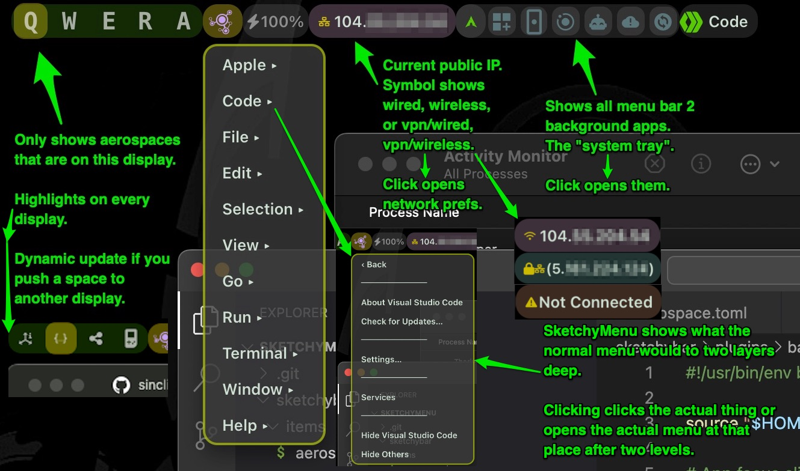
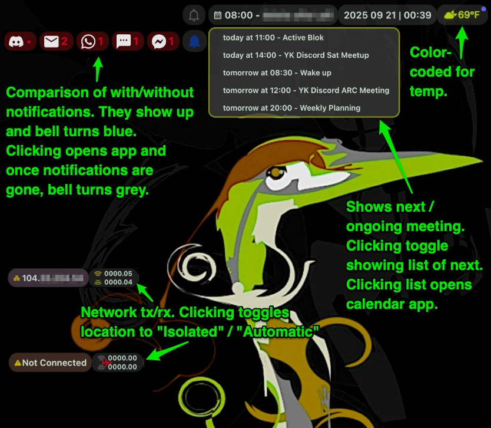
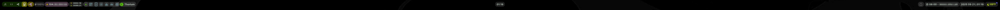

# SketchyMenu
I went down a rabbit hole and now there are these plugins for FelixKratz's absolutely amazing [SketchyBar](https://github.com/FelixKratz/SketchyBar).

## Visuals

## Items / Plugins
- **SketchyMenu** ([loader](sketchybar/plugins/sketchymenu/app_menu.sh), [JXA](sketchybar/plugins/sketchymenu/get_menu.js), [clicker](sketchybar/plugins/sketchymenu/click_menu_item.applescript)) (item: [`menu.sh`](sketchybar/items/menu.sh)): Clickable pop-out of the front app’s menu bar with lazy-loaded submenus.
- **Notifications** ([script](sketchybar/plugins/notifications.sh)) (item: [`notifs.sh`](sketchybar/items/notifs.sh)): Shows per‑app badges from the Dock; click to open the app.
-  **Aerospace Workspaces** ([script](sketchybar/plugins/aerospace.sh)) (item: [`aerospace.sh`](sketchybar/items/aerospace.sh)): Shows and highlights the active workspace per monitor and lets you switch with a click. Auto moves workspaces when you bump them to a new monitor.
-  **Running Apps Island** ([runner](sketchybar/plugins/bar_apps/running_apps.sh), [focus](sketchybar/plugins/bar_apps/app_focus.sh), [JXA](sketchybar/plugins/bar_apps/get_running_apps.applescript)) (item: [`running.sh`](sketchybar/items/running.sh)): Icons for apps with a secondary menu bar (the "system tray"); click to focus.
- **Network Traffic & Airplane Mode** ([stats](sketchybar/plugins/net/network_stats.sh), [toggle](sketchybar/plugins/net/toggle_airplane.sh)) (item: [`net.sh`](sketchybar/items/net.sh)): Live TX/RX Mbps with stacked labels; click to toggle an isolated network location.
- **Public IP & Connection** ([script](sketchybar/plugins/get_public_ip.sh)) (item: [`public.sh`](sketchybar/items/public.sh)): Shows public IP with wired/Wi‑Fi/VPN status; click to open Network prefs.
- **Meetings / Calendar** ([script](sketchybar/plugins/calendar_info.sh)) (item: [`meetings.sh`](sketchybar/items/meetings.sh)): Next event label with popup of upcoming events; click to open Notion Calendar.
- **Weather** ([script](sketchybar/plugins/weather.sh)) (item: [`weather.sh`](sketchybar/items/weather.sh)): Colors the Weather alias by temperature and opens Apple Weather on click.
- **Date & Time** ([script](sketchybar/plugins/datetime.sh)) (item: [`datetime.sh`](sketchybar/items/datetime.sh)): Time or date+time depending on position; click to open calendar.

## Requirements
- jq — used by SketchyMenu loader, Date & Time, Network Stats, and Running Apps to parse SketchyBar JSON.
- macOS Accessibility — enable for SketchyBar and `osascript` (System Settings → Privacy & Security → Accessibility). Required by SketchyMenu (AppleScript/JXA), Running Apps, and Notifications.
- icalBuddy — used by Meetings/Calendar to list upcoming events.
- AeroSpace (CLI) — used by Aerospace Workspaces to query/activate workspaces.
- Nerd Font (e.g., Hack Nerd Font Mono) — provides icon glyphs referenced via `$NERD_FONT` across items.
- curl — used by Weather (wttr.in) and Public IP.
- macOS networking tools (`networksetup`, `netstat`, `ifconfig`, `scutil`, `route`) — used by Network Traffic/Airplane and Public IP.
- Path expectations — `sketchybar/sketchybarrc` sets `PLUGIN_DIR`/`ITEM_DIR` and sources `colors.sh`/`icons.sh` from `$HOME/conf/sketchybar/`. Mirror this repo’s `sketchybar/` there or update paths.
- Optional: Notion Calendar — click actions in Meetings/Date & Time open it if installed.
- Optional: Create a Network Location named "Isolated" — used by the Airplane Mode toggle.

### The full bar

## Shameless Plug
Think this is great?

Over the next few months some amazing AI research is going to start popping up over at my company's org. Check it out on occasion: [Ardea's GitHub](https://github.com/ArdeaAI)

We're evolving stuff to let sand realize it is sand!
